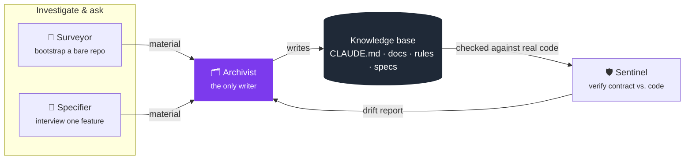

<div align="center">

# Δ Delta

**A living-documentation methodology for AI coding agents.**

[](https://claude.com/claude-code)
[](https://cursor.com)
[]()
[]()

</div>

---

Most project context lives in one of two bad places: a person's head, or an ever-growing history of decisions that costs more to read than it's worth. **Delta** treats documentation as a set of **living contracts** instead — files that describe what is true *right now*, edited in place as things change, never appended to as a log. Superseded content is simply gone; git history is already the record of what used to be true.

This repository *is* the harness: the skills, rules, and templates that implement Delta, packaged for both [Claude Code](https://claude.com/claude-code) (`.claude/`) and [Cursor](https://cursor.com) (`.cursor/`). Drop either folder into a project and its agent gains four new capabilities for creating and maintaining that project's documentation.

## Contents

- [The four-role pipeline](#the-four-role-pipeline)
- [What the knowledge base looks like](#what-the-knowledge-base-looks-like)
- [Using this repo](#using-this-repo)
- [Repository layout](#repository-layout)
- [Non-goals](#non-goals)

---

## The four-role pipeline

Delta enforces "every piece of context lands in the right shape, every time" with four narrow, single-responsibility skills rather than one do-everything assistant. Bootstrap and interview investigate and ask; verify checks; **only the write stage commits a change**:



| Skill | Role | Its reason to change | Writes to the knowledge base? |
|---|---|---|:---:|
| 🧭 **Surveyor** | Bootstraps a repo that has no knowledge base yet — scans the codebase (or interviews, if greenfield) breadth-first | "did the project get oriented fast and accurately" | ❌ hands off to Archivist |
| 📝 **Specifier** | Gathers what code alone can't answer for one feature — intent, invariants, open questions, UI states/interactions | "did we ask the right questions and find the right conflicts" | ❌ hands off to Archivist |
| 🗂️ **Archivist** | Lands material into the correct artifact shape — a doc, a rule, an agent, a skill, or a feature's contract | "does the artifact land in the right shape" | ✅ the sole writer |
| 🛡️ **Sentinel** | Verifies whether an already-written contract still holds against the real implementation | "does the implementation still match its contract" | ❌ reports drift, hands corrections back |

> A hand-edit to any of these files skips the pipeline and is exactly the kind of drift Delta exists to prevent — the one exemption is a trivial, already-settled fix (a typo, a stale command, a plan step visibly done).

Full step-by-step instructions for each skill live in `.claude/skills/<name>/SKILL.md` (and the Cursor-flavored equivalent under `.cursor/skills/`).

---

## What the knowledge base looks like

Once bootstrapped, a project's Delta knowledge base has three layers — a router, a curated reference, and per-feature contracts:

```
CLAUDE.md                      router — orients a session fast, points at everything else
.claude/docs/                  curated, project-wide reference (always 6 files)
   ├─ overview.md                 vision, scope, domain concepts
   ├─ modules.md                  per-component functional reference
   ├─ structure.md                stack, topology, infrastructure, cross-cutting patterns
   ├─ database.md                 data model + persistence infrastructure
   ├─ expertise.md                non-obvious mechanisms/concepts the project leans on
   └─ approach.md                 build philosophy, roadmap, done criteria
.claude/rules/<topic>.md       conventions auto-loaded when matching files are touched
.claude/agents/<name>.md       bounded, repeatable subagents with their own tools/context
services/<service>/deltas/     per-feature living contracts ("slices")
   ├─ <slice>.spec.md             logic-layer contract: intent, invariants, acceptance criteria
   ├─ <slice>.design.md           presentation-layer contract (only if the slice has a UI)
   └─ <slice>.plan.md             disposable step-by-step roadmap (deleted once it lands)
```

A **slice** is a bounded feature or capability — sized the way a bounded context would be, not a source file. Two slices whose contracts keep changing together for the same reason are really one slice wearing two names.

Every doc/rule stays self-contained and free of volatile references — no citing a specific file path or function name as proof a convention exists, since that breaks the moment something is renamed. A `spec.md`/`design.md`, by contrast, is expected to name the real implementation, since that's the whole point of a contract checked against it.

---

## Using this repo

This repo has no application source of its own — it *is* the reusable harness.

```
1. copy .claude/ and/or .cursor/ into your project
2. "bootstrap this repo with Delta"        → Surveyor writes CLAUDE.md + .claude/docs/*
3. "let's spec out <feature>"              → Specifier interviews, Archivist writes <slice>.spec.md
4. "check <feature> for drift"             → Sentinel verifies the contract against the code
5. anything else worth documenting         → Archivist, directly
```

1. **Copy** `.claude/` (for Claude Code) and/or `.cursor/` (for Cursor) into the target repo.
2. **Bootstrap** — *"bootstrap this repo with Delta"* / *"arranca el harness aquí"* — invokes 🧭 **Surveyor**, which produces `CLAUDE.md` and fills in the six `.claude/docs/*` files from what it finds in the codebase (or from a short interview, if the repo is greenfield).
3. **Spec a feature** — invokes 📝 **Specifier**, which investigates and interviews, then hands off to 🗂️ **Archivist** to write `<slice>.spec.md` (and `<slice>.design.md` for anything with a UI).
4. **Verify** after implementing — invokes 🛡️ **Sentinel**, which checks the spec's invariants against the real code and reports drift as a compact table:

   `Holds` · `Violated` · `Stale` · `Unverified` · `Gone` · `Conflict`

5. **Anything else** — a convention, a subagent, an update to `CLAUDE.md` — ask directly; that routes to 🗂️ **Archivist**.

Both English and Spanish trigger phrases are recognized by the skills' own descriptions.

---

## Repository layout

| Path | Purpose |
|---|---|
| `.claude/skills/` | The four skills' instructions (`SKILL.md`) and their fill-in templates (`references/`) |
| `.claude/rules/` | Editing conventions for the knowledge base itself — route through the matching skill, don't hand-edit |
| `.claude/agents/`, `.claude/docs/` | Empty/skeleton here — populated per-project once bootstrapped, not part of the harness itself |
| `.claude/settings.json` | Baseline permission allow/deny list for Claude Code sessions |
| `.cursor/` | Same structure, adapted for Cursor's rule/agent conventions (`.mdc` rule files, no `settings.json`) |

## Non-goals

- Delta does not keep an append-only decision log. When two sources disagree, the conflict is resolved explicitly and the resolution becomes the corrected text — nothing else is kept beyond that.
- Sentinel only checks a slice's `spec.md`/`design.md`/`plan.md` against the code — it doesn't audit `.claude/docs/*` or `.claude/rules/*` for drift.
- None of the four skills write application code. Delta manages context *about* a codebase, not the codebase itself.
